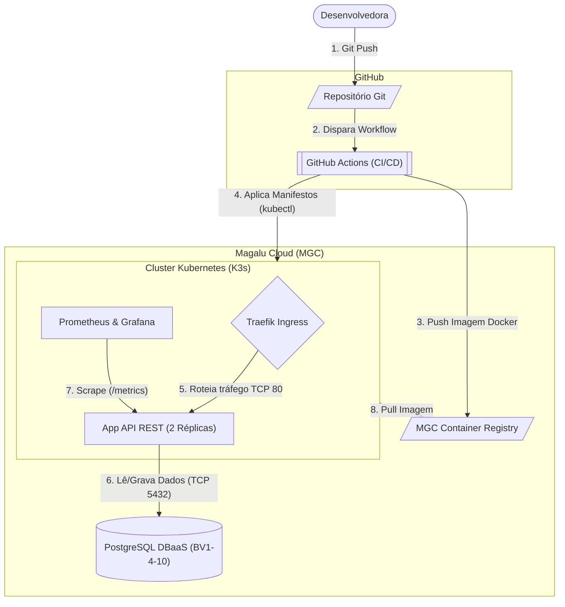

# Cloud API Delivery & K3s (DevSecOps Pipeline)

Este repositório contém a infraestrutura como código (IaC) e a esteira de automação (CI/CD) para o provisionamento, segurança e entrega contínua de uma API REST em um cluster Kubernetes, utilizando os serviços da Magalu Cloud.

##  Objetivos de Negócio e Engenharia

Este projeto foi desenhado para resolver três desafios críticos na operação de engenharia de software:

*   **Remoção de Gargalos na Entrega (CI/CD):** Substituição de deploys manuais por uma esteira automatizada no GitHub Actions, garantindo que o código seja empacotado, testado e publicado de forma padronizada, rápida e auditável.
*   **Segurança Contínua (Shift-Left Security):** Integração de análises estáticas de segurança (SAST) com CodeQL e verificação de composição de software (SCA) com Dependabot. A esteira bloqueia proativamente vulnerabilidades críticas antes que cheguem ao ambiente de produção.
*   **Alta Disponibilidade e Self-Healing:** Arquitetura resiliente baseada em Kubernetes (K3s). A aplicação opera no modelo *stateless*, com o estado isolado em um banco de dados gerenciado (DBaaS PostgreSQL). Em caso de falhas de memória (OOMKilled) ou travamentos, o cluster orquestra a auto-recuperação sem indisponibilidade para o usuário final.

---

##  Diagrama de Arquitetura (C4 Model - Nível 2)

A topologia da solução reflete um fluxo seguro e automatizado, desde o commit da desenvolvedora até a exposição segura da aplicação:

---

##  Stack Tecnológica

*   **Orquestração e Containers:** Kubernetes (K3s), Docker.
*   **Automação e CI/CD:** GitHub Actions.
*   **Segurança (DevSecOps):** CodeQL (SAST), Dependabot (SCA), Kubernetes Secrets.
*   **Provedor Cloud (MGC):** Magalu Cloud (CLI, Container Registry, DBaaS PostgreSQL, VM/Security Groups).
*   **Observabilidade:** Prometheus, Grafana.

---

##  Documentação e Decisões Arquiteturais (ADRs)

Para garantir a rastreabilidade e facilitar a resposta a incidentes, as decisões de engenharia e os procedimentos operacionais estão documentados na pasta `docs/`:

*   **[ADR-0001: Adoção de Banco de Dados Externo (DBaaS)](docs/ADR-0001-DBaaS.md)**
*   **[ADR-0002: Estratégia de Ingress e ClusterIP no K3s](docs/ADR-0002-Ingress-ClusterIP.md)**
*   **[Runbook: Troubleshooting de Falhas no Kubernetes](docs/RUNBOOK-Troubleshooting.md)**
